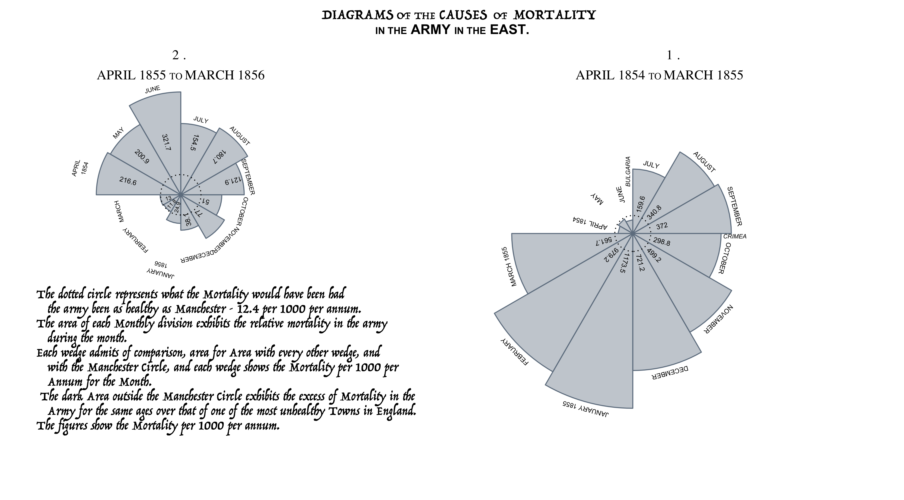

# Florence Nightingale
#### by Edward Gunning

Celebration of Florence Nightingale's Bicentenary by recreating some of her work with `ggplot2` and other R packages. See [Hugh Small's article](https://www.york.ac.uk/depts/maths/histstat/small.htm) for a description of Nightinale's statistical diagrams.

I have uploaded a scanned (color) pdf containing some of the original diagrams and data called  `MortalityofTheBritishArmy.pdf`. It's available at [this archive](https://archive.org/details/mortalityofbriti00lond/page/n41/mode/2up).

## 1 Nightingale's Coxcombs/ Rose Diagrams
The originals are from [A Contribution to the Sanitary History of the British Army (1859)](https://curiosity.lib.harvard.edu/contagion/catalog/36-990101646750203941), pg 17-19.

Perhaps Nightingale's most famous diagram, known as the _Coxcomb_, the _Polar Area Chart_ or the _Rose Diagram_. [Understanding Uncertainty](https://understandinguncertainty.org/node/214) provides a good description of the mathematics behind the coxcomb. Code for the first rose diagram is [here](https://github.com/edwardgunning/FlorenceNightingale/blob/master/Rose%20Diagram%20Code.R).

And code for the second is [here](https://github.com/edwardgunning/FlorenceNightingale/blob/master/Rose%20Diagram%20Code.R).

## 2 Nightingale's Lines Diagram

An aim to create to recreate [this classic bar chart](https://archive.org/details/mortalityofbriti00lond/page/n33/mode/2up).
I've transcribed the data from  [here](https://archive.org/details/mortalityofbriti00lond/page/12/mode/2up) and uploaded it [here](https://github.com/edwardgunning/FlorenceNightingale/blob/master/EnglishMortalityData.xlsx).

The code to create the line chart is in [this script](https://github.com/edwardgunning/FlorenceNightingale/blob/master/Lines%20Diagram%20B.R).

## 3 Nightingale's Area Diagrams

Original [here](https://archive.org/details/mortalityofbriti00lond/page/n39/mode/2up). Certainly my favorite to recreate. [Code](https://github.com/edwardgunning/FlorenceNightingale/blob/master/Area%20Charts.R) contains a really easy data manipulation from the [life table](https://github.com/edwardgunning/FlorenceNightingale/blob/master/EnglishMortalityData.xlsx) and a `facet_wrap` to create the plot:

This one was so straightforward that I didn't even have to change the default ggplot colors!

