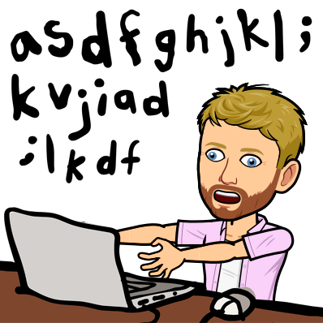

```{r setup, include = F}
# This is the recommended set up for flipbooks
# you might think about setting cache to TRUE as you gain practice --- building flipbooks from scracth can be time consuming
knitr::opts_chunk$set(fig.width = 8, message = FALSE, warning = FALSE, comment = "", cache = FALSE, fig.retina = 3)
library(flipbookr)
library(tidyverse)
library(HistData)
library(lubridate)
library(ggtext)
library(cowplot)
library(scales)
```

class: center


<br> 
# #FloViz
# Recreating Nightingale's Coxcombs 
## with the `tidyverse`

<br>

## Edward Gunning
## University of Limerick
###  27/05/2020
---
layout: true

.center[
# About me
]

.pull-left[
.bigtext[
- Statistics.

- CRT in foundations of Data Science.

- Interested in #DataViz & #rstats.
]
]
---
---
count: false
.pull-right[


]
---
count: false
.pull-right[

]
---
layout: false
.center[
# Motivation
]
--
.pull-left[
.midtext[
Data visualisation is all around us, which is great:
]

]
--
.pull-right[
<br>

.midtext[
...well, most of the time.
]
]
---
layout: true
.center[
# Florence Nightingale
]
---
.center[
<br>


_source: [BBC Bitesize Science](https://www.bbc.co.uk/bitesize/topics/zns9nrd/articles/znsct39)_
]
---
count: false
.center[
### Data Visualisation Pioneer
]
--
.midtext[
- Used statistical diagrams to communicate messages for sanitary reform during and after the Crimean war.]
--
<br>
.midtext[
- "... were more topical and conveyed a call to action - they were prescriptive rather than descriptive." [(Small, 1998)](https://www.york.ac.uk/depts/maths/histstat/small.htm)
]
--
<br>
.midtext[
- "...would love the data journalism we have today. But she'd hate some of the ways that data are abused." [(Spiegelhalter, 2019)](https://www.bbc.co.uk/ideas/videos/what-would-florence-nightingale-make-of-big-data/p075lxkt)
]
---
layout: false


.center[
# My Goal
]
--
.pull2-left[
.midtext[
Recreate amazing graphics like this]

_source: [A Contribution to the Sanitary History of the British Army (1859)](https://curiosity.lib.harvard.edu/contagion/catalog/36-990101646750203941), pg 17-19._
]
--
.pull2-right[
.midtext[...with these tools]
<br>
<br> 

```{r, echo=F, fig.align='center'}
knitr::include_graphics(path = "ggplot2 logo.png")
```

```{r, echo=F, fig.align='center'}
knitr::include_graphics(path = "Tidyverse Logo.png")
```
]
--
<br>
<br> 

.center[
.midtext[...and a __"Flipbook"__.]]

---
.center[
# Why `ggplot2`?
]
--
.midtext[
- Based on a deep underlying grammar [(Wickham, 2016)](https://ggplot2-book.org/introduction.html)
]
--
.midtext[
- "...allows us to move beyond named graphics (e.g., the “scatterplot”) and gain insight into the deep structure that underlies statistical graphics." [(Wickham, 2010)](http://vita.had.co.nz/papers/layered-grammar.html)
]
--

.midtext[
```{r, echo=F, fig.align='center', out.height="30%", out.width='40%'}
knitr::include_graphics(path = "grammar1.png")
```
]
.center[
_source: [The Grammar of Graphics (Wilkinson, 2005)](https://www.springer.com/gp/book/9780387245447)_
]
---
layout: true 
class: hide-logo
.center[
# 1. The Polar Area Diagram]
---
---
count:false
```{r, echo=F, fig.align='center'}
knitr::include_graphics(path = "NotDrawnPolar.png")
```
.center[_source: [A Contribution to the Sanitary History of the British Army (1859)](https://curiosity.lib.harvard.edu/contagion/catalog/36-990101646750203941), pg 17-19._]
---
count:false
```{r, echo=F, fig.align='center'}
knitr::include_graphics(path = "Drawn On Polar.png")
```
.center[_source: [A Contribution to the Sanitary History of the British Army (1859)](https://curiosity.lib.harvard.edu/contagion/catalog/36-990101646750203941), pg 17-19._]
---

layout:false

count: true

```{r, include=F}
stagger <- function(x){
  ifelse(sqrt(x)>sqrt(40), sqrt(x), sqrt(40))
}

mname <- function(x){
  toupper(month.name[month(x)])
}

text_angle = 90 - 360 * (c(1:12)-0.5) /12 
text_angle[1:3] <- 90 + text_angle[1:3]
textangle2 = 180+360/(2*pi)*rev( seq( pi/12, 2*pi-pi/12, len=12))

knitr::opts_chunk$set(fig.height = 9)
```


```{r nighting, include = FALSE}
Nightingale  %>%
  filter(Date<='1855-03-01') %>% 
  mutate(death_rate=(Disease.rate + Wounds.rate + Other.rate)) %>%
  mutate(Label=case_when(Date=='1855-01-01' ~ "JANUARY 1855",
    Date=='1855-03-01' ~ "MARCH 1855",
    Date=='1854-04-01' ~ "APRIL 1854",
    TRUE ~ mname(Date))) %>% 
  ggplot()+
  aes(x=month(Date), y=sqrt(death_rate))+
  geom_bar(width=1, stat="identity", fill="slategrey", color="slategrey", alpha=0.4)+
  coord_polar(theta="x", start=(6/12)*2*pi, clip = "off")+
  theme_void()+
  theme(plot.margin = margin(t=-100,b=-100,50,r=-100))+
  geom_text(aes(label=Label), position = "identity",angle= text_angle[-c(1:3)], vjust=-1,data=.%>% filter(!(month(Date)%in%c(4:6))))+
  geom_text(aes(label=Label, y=3*sqrt(death_rate)), angle=text_angle[1:3], position = "identity",data=.%>% filter(month(Date)%in%c(4,5,6)))+
  geom_text(aes(label=death_rate,y = sqrt(40)), angle=textangle2[-c(1:3)], data=.%>% filter(!(month(Date)%in%c(4,5,6))), face="italic")+
  geom_hline(yintercept = sqrt(12), linetype="dotted")+
  labs(subtitle = "1 . <br> APRIL 1854 <span style='font-size:10pt'>TO </span>MARCH 1855")+
  theme(plot.subtitle = element_markdown(hjust = 0.5, lineheight = 1.5, family="serif",margin = margin(t=65,b =-120), size=16))+
  annotate(label="CRIMEA", geom = "text", x=9.5, y=22, fontface="italic")+
  annotate(label="BULGARIA", geom = "text", x=6.385, y=15.9, fontface="italic", angle=90)
```

`r chunk_reveal("nighting", break_type = "auto", split = 40, title = "Polar Area Chart")`
--

---


```{r, echo=F}
knitr::opts_chunk$set(fig.width = 18, fig.height = 13, fig.align = 'center')
```

```{r fullrose, include=FALSE}
source("roseplotsource.R")
Nightingale  %>%
  mutate(year_num = factor(ifelse(Date<='1855-03-01', "Y1", "Y2"), levels = c("Y1","Y2"),
                           labels=c(" 1 . <br> APRIL 1854 <span style='font-size:16pt'>TO </span>MARCH 1855",
                                    "2 . <br> APRIL 1855 <span style='font-size:16pt'>TO </span>MARCH 1856"))) %>%
  mutate(Label=case_when(
    Date=='1855-01-01' ~ "JANUARY 1855",
    Date=='1855-03-01' ~ "MARCH 1855",
    Date=='1854-04-01' ~ "APRIL 1854",
    Date=='1856-01-01' ~ "JANUARY \n 1856",
    Date=='1855-04-01' ~ "APRIL \n 1854",
    TRUE ~ toupper(month.name[month(Date)])), #### added the labels
    death_rate=(Disease.rate + Wounds.rate + Other.rate),
    label_pos = ifelse(sqrt(death_rate)>10, sqrt(death_rate), 10)) %>%
  ggplot()+
  aes(x=month(Date), y=sqrt(death_rate))+
  facet_wrap(~fct_rev(year_num))+
  theme_void()+
  theme(plot.margin = margin(b=30, r=-400,l=-400),
        panel.spacing = unit(-5, "lines"),
        strip.text = element_markdown(margin = margin(b=0, t=10), size = 20, family = "serif"),
        plot.title = element_markdown(size=24, hjust = 0.5, family = "serif", margin = margin(b=-20)),
        plot.subtitle = element_markdown(size=24, hjust = 0.5, margin = margin(b=-40, t=20)))+
  geom_bar(stat = "identity", width=1, fill="slategrey", alpha=0.3, color="slategrey")+
  coord_polar(theta = "x", clip="off", start=pi)+
  labs(title = "DIAGRAMS <span style='font-size:18pt'> OF THE</span> MORTALITY",
       subtitle="<span style='font-size:16pt'>IN THE</span> ARMY <span style='font-size:18pt'>IN THE</span> EAST.")+
  geom_hline(yintercept = sqrt(12), linetype="dotted")+
  geom_text(aes(label=Label), data=.%>% filter(as.integer(year_num)==1 & !(month(Date)%in%c(4:6))), angle=textangle[-c(1:3)], vjust=-1, size=4)+
  geom_text(aes(label=Label, y=2.5*sqrt(death_rate)), data=.%>% filter(as.integer(year_num)==1 & (month(Date)%in%c(4:6))), angle=alt_angle, size=4)+
  geom_text(aes(label=Label, y=label_pos), position = "identity", vjust=-1, data=.%>% filter(as.integer(year_num)==2), size=3, angle= textangle)+
  geom_text(aes(label=death_rate, y = sqrt(35)), angle=textangle2[-c(1:3)], data=.%>% filter(as.integer(year_num)==1 & !(month(Date)%in%c(4:6))), size=4.5)+
  geom_text(aes(label=death_rate, y = sqrt(85)), data=.%>% filter(as.integer(year_num)==2 &!(month(Date)%in%c(12,1,2,3,10,11))), size=4, angle=textangle2[1:6])+
  geom_text(aes(label=death_rate, y = sqrt(20)), data=.%>% filter(as.integer(year_num)==2 & month(Date)%in%c(10,11,12)), size=4, angle=textangle2[7:9])+
  geom_text(aes(label=death_rate, y = sqrt(5)), data=.%>% filter(as.integer(year_num)==2 & month(Date)%in%c(1,2,3)), size=2.8, angle=textangle2[10:12])+
  geom_text(data=anno_df, aes(x=x,y=y, label=label, angle=angle), size=3.5, fontface="italic")+
  geom_text(data=detailed_text, aes(x=x, y=y, label=d_text), size=6.5, hjust=0, family="Trattatello")
```

`r chunk_reveal("fullrose", break_type = "auto", display_type="output", split=100)`

---

```{css, eval = TRUE, echo = FALSE}
.remark-code{line-height: 1.5; font-size: 80%}
```
